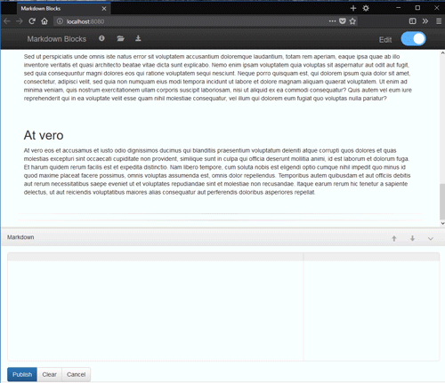

## MarkdownBlocks
User-friendly markdown editor build with React.

### Objective
Create a simple markdown editor with the intention of learning React/Redux. Currently a work-in-progress (see [TODO.md](TODO.md)).

### Preview
Current project status:




### Installation & Setup
After downloading navigate to the project directory from the command line and install project dependencies using ```npm install```:

```
cd markdown-blocks
npm install
```

After installation the following NPM scripts are available to build and run the editor:

**1. Dev Server:**

- Generate webpack bundle, enabling hot module replacement using webpack-dev-server:
    ```
    npm start
    ```

**2. Local File**

- Generate webpack bundle (one-time build):
    ```
    npm run build
    ```

- Generate webpack bundle and initiate webpack watch mode:
    ```
    npm run watch
    ```

### Dependencies
MarkdownBlocks uses a combination of [React](https://reactjs.org/), [Redux](https://redux.js.org/), [Webpack](https://webpack.js.org/) and [Babel](https://babeljs.io/) in addition to the following excellent libraries:

|  Library 	                                            	| For           		                |
|:------------------------------------------------------- | :-------------------------------- |
| [marked](https://github.com/chjj/marked)              	| Markdown rendering                |
| [Ace](https://ace.c9.io/)                             	| Text editor, sytax highlighting	  |
| [react-ace](https://github.com/securingsincity/react-ace) | Ace React component             |
| [Bootstrap](https://getbootstrap.com/docs/3.3/)       	| Base components/style             |

Up-to-date version of Node.js required. See [package.json](package.json) for a complete list of dependencies.

### License
[MIT](LICENSE)